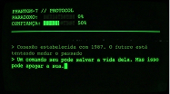

# PHANTOM-7 // PROTOCOLO DE TRANSMISSÃO

  

### <LOG_ENTRY: STATUS_SISTEMA

Em **2099**, a tecnologia que conhecemos é apenas sucata digital. No entanto, escondida nas camadas de um antigo terminal CRT, foi detetada uma anomalia: um sinal analógico, vindo diretamente de **1987**. No outro lado da fenda está **Kaori**, uma cientista cujos passos no laboratório Setor 4 estão a ser caçados por algo que o código não consegue identificar.

Você assume o papel de **Operador**, o último elo entre o presente colapsado e um passado que recusa ser apagado...
Através do sistema **PHANTOM-7**, você deve guiar Kaori por uma jornada tática onde cada movimento aumenta o Paradoxo Temporal.

### ⚠️ AVISO DE SEGURANÇA
Você está acessando uma fenda temporal não autorizada. A segurança é uma ilusão. O código que você vê é apenas a casca; o que está por baixo pode sobrescrever sua realidade. **Não olhe diretamente para o glitch**.

### 🚀 Como Jogar
Baixe o arquivo zip, extraia e acesse o `index.html` no seu navegador.

**Caminho:** `src` > `index.html`

### 🛠️ Conceitos de POO Aplicados
<pre><code> |-- [ CLASSES ]
 |    |-- Cena (Base)
 |    `-- CenaSacrificio (Polimorfismo / Glitch)
 |
 |-- [ MOTOR TÁTICO ]
 |    |-- Grid 5x5 (Canvas API)
 |    |-- IA de Perseguição (Invasores)
 |    `-- Verificação de Escopo (check)
 |
 `-- [ ESTADOS ]
      |-- Paradoxo Temporal
      |-- Confiança (Kaori)
      `-- Overheat (Final de 2099)
</code></pre>

### 🤖 Uso de IA
Este projeto foi desenvolvido com auxílio das ferramentas:
1. Gemini (Google)
2. ChatGPT (OpenAI)
   
*Detalhes das comparações e prompts estão na pasta relatórios .*

### 📎 Referências
- **MDN Web Docs**
- **w3schools**
- **Mario Souto(Dev-soutinho):** https://www.youtube.com/watch?v=jOAU81jdi-c&list=PLTcmLKdIkOWmeNferJ292VYKBXydGeDej
